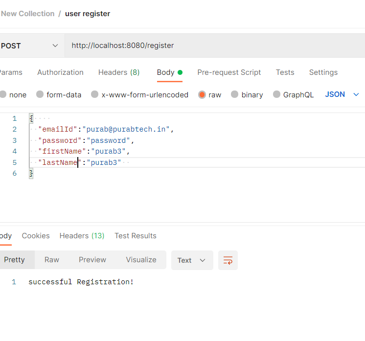

Example code of User Registration with confirmation email using Spring boot + RestAPI

Code has this features:
1. Registration
2. Reg Email sending for confirmation
3. Fake email testing

Sample Postman request


#### Note: using https://mailtrap.io/ for email testing

Docker file add in this project and k8s deployment file is added

Some docker commands
1. You can run the application by using this command on terminal
```
./mvnw spring-boot:run
```
2. 3. For creating jar need to run this command 
```
./mvnw clean package
```
3. jar will create in build/libs folder
4. you can run app using this command with jar
```
java -jar target/register-fake-mail-async-0.0.1-SNAPSHOT.jar
```
5. create file named "Dockerfile"

create docker image with docker file
```shell
#cd d:\workspace\register-fake-mail-async
#docker build -t register-fake-mail-async:v1 .
```

Give tag to docker image and push image to docker hub
```shell
#docker tag register-fake-mail-async purabdk/register-fake-mail-async
#docker push purabdk/register-fake-mail-async
```

remove docker images from local docker hub
```shell
#docker rmi docker-spring purabdk/register-fake-mail-async
```

docker pull image from docker hub and run it
```shell
#docker run -p 8080:8080 purabdk/register-fake-mail-async
```

check running container
```shell
#docker ps
```

stop running container
```shell
#docker stop CONTAINER_ID
```

# Jenkins
Ref:
[Jenkins War Download](https://www.jenkins.io/download/)
[Jenkins Doc](https://www.jenkins.io/doc/book/installing/initial-settings/)


Start jenkins on local machine

```
wsl
java -jar /mnt/c/NON-INSTALLED-SOFTWARES/jenkins.war --httpPort=9090
```

go to http://localhost:9090/pluginManager/ for installing docker related plugins
Docker, Docker Pipeline,docker-build-step,CloudBees Docker Build and Publish

//Note: use Multibranch pipeline and just put your git repo url.
Do variable changes and you can use jenkins build with docker image push..

# SSL certificate integration

SSL certificate setting applied in application.properties file
To generate self signed SSL certificate use following command:
```
cd src/resources
keytool -genkeypair -alias local_ssl -keyalg RSA -keysize 2048 -storetype PKCS12 -keystore loacal-ssl.p12 -validity 365 -ext san=dns:localhost
```

For production use following command and use p12 file in application
Convert .crt to .p12
```
openssl pkcs12 -export -out server.p12 -inkey server.key -in server.crt
```
Where server.key , is the server key . server.crt is cert file from CA or self sigh
Add this in application.properties
```
server.port=8443
#server.port=8080
server.ssl.enabled: true
server.ssl.key-alias: local_ssl
server.ssl.key-store: classpath:loacal-ssl.p12
server.ssl.key-store-type: PKCS12
server.ssl.key-password: 12345678
server.ssl.key-store-password: 12345678

```
# K8S Helm chart

helm create register-fake-mail-async
```
docker build -t register-fake-mail-async:v1 .
```
https://chocolatey.org/install

Install helm chart on windows 10 and docker desktop
```
choco install kubernetes-helm
```

```
helm create k8s-helm-chart
helm install --name-template register-fake-mail-async -f ./k8s-helm-chart/values.yaml ./k8s-helm-chart/
helm ls --all
helm upgrade register-fake-mail-async ./k8s-helm-chart
helm rollback register-fake-mail-async 1
helm uninstall register-fake-mail-async
helm package ./k8s-helm-chart
```
### More information here:
* https://github.com/purab/helm-chart-spring-boot
* https://github.com/gruntwork-io/helm-kubernetes-services/tree/master/charts/k8s-service
* https://github.com/helm/charts/tree/master/stable/heapster